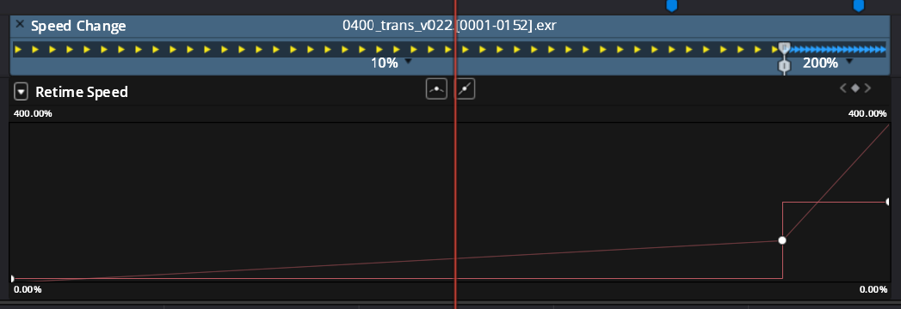

# README

This is a testing module trying to help understand how Resolve structures OTIO and how to work with it.

## Explanation 
I'm using this formula to calculate speed change between 2 points in time.

$SpeedChange_{InOut} = \frac{OutOriginal - InOriginal}{OutChanged - InChanged}$

### Resolve Single Keyframe Example
A speed keyframe in Resolve contains 7 elements of which the first 2 assumingly represent these speed change values in seconds in reference to the clip on the timeline including invisible/available handles on that clip.
For `x` user keyframes you will have `x+2` keyframes available in OTIOs effect representing the start and end of the clips available (retimed) range.
```json
"OTIO_SCHEMA": "TimeEffect.1",
    "metadata": {
        "Resolve_OTIO": {
            "Key Frames": [
                [
                    0.0,
                    0.0,
                    false,
                    0.0,
                    0.0,
                    0.0,
                    0.0
                ],
                [
                    15.906236312658555,
                    1.5906236312658553,
                    false,
                    0.0,
                    0.0,
                    0.0,
                    0.0
                ],
                [
                    18.110924497025626,
                    6.0,
                    false,
                    0.0,
                    0.0,
                    0.0,
                    0.0
                ]
            ],
            "Speed Ratio": 0.3312917571372674
        }
    },
    "name": "",
    "effect_name": ""
},
```

From that trying to lookup the clip's source media frame at retimed in and out positions represented as blue markers in the image above.

This example's clip in could be expressed by inserting into the general formula with the following list.
- $SpeedChange_{InOut}$ as $\Delta{IK}$
- $OutOriginal$ as $K_1$
    - the second element in OTIO TimeEffect of user keyframe
    - `TimeEffect["metadata"]["Resolve_OTIO"]["Key Frames"][1][1]`
- $InOriginal$ as $I_1$
- $OutChanged$ as $K_0$
    - the first element in OTIO TimeEffect of user keyframe 
    - `TimeEffect["metadata"]["Resolve_OTIO"]["Key Frames"][1][0]`
- $InChanged$ as $I_0$
    - this is interpreted as the `clip.source_range.start_time` multiplied by the speed change at that position
    - the speed changes here would be `[0.1, 2.0]`
    - > for the tangents this could be another lookup right?

Resulting in $\Delta{IK} = \frac{K_1 - I_1}{K_0 - I_0}$.
The variable we don't have is $I_1$ so solving for it should be:

$I_1 = K_1 - \Delta{IK}(K_0-I_0)$


